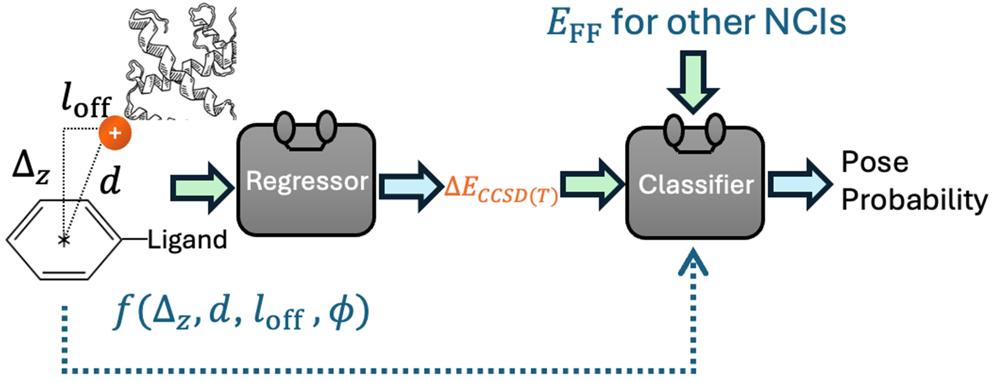

## Overview
An SOTA method (evaluated on PoseBusters, DeepDockingDare, DockGen cationic binding pocket subsets) trained on DLPNO-CCSD(T) dimer interaction energies for quantitatively evaluating non—covalent interaction strength and guiding docking ligand into  cationic protein binding pocket. 
To use our docking method, you need to prepare the protonated protein in PDB format and the ligand's initial position in SDF format. 

## Framework overview




## Environments
First, clone our repo. 
```bash
git clone https://github.com/zhuoy-qc/QNCIDock.git
```
Then, we recommend using Conda to set up the environment.
```bash
conda env create -f QNCIDock.yml
```
```bash
conda activate QNCIDock
```

## Data Organization
PicationDock requires a specific folder structure for proper execution. The dataset should be structured as follows:
should be placed under ***/QNCIDock/.../...

- **Folder Name:** A four-character identifier,  typically matching the PDB ID and ligand ID, e.g., 6HA4_T3Y
- The following files are required in each folder named (e.g., 6HA4_T3Y)
  - `<folder_name>_ligand.sdf`      --ligand file in sdf format, used for auto-generating a docking box (default +8 on all six sides)
  - `<folder_name>_protein_protonated.pdb ` --protonated protein file in pbd format 


Ensure that all required files are present before running.


## Docking Guide
We first demonstrate how to dock 6HA4_T3Y from the DockGen Dataset for you to try. First, change into the directory '*replace with your path*'/QNCIDock/Example_6HA4_T3Y
### 1. Sample
```bash
python sample_vina.py
```
 This will generate exhaust50_dock.sdf, which contains the Vina raw ranking of 50 sampled poses.
### 2. Compute the RMSD of each sampled pose for later evaluation only
```bash
python compute_rmsd_for_docked_pose.py
```
This will compute the RMSD of each sampled pose relative to the reference experimental ligand pose and save the results, including the Vina score, in a CSV file. Reference ligand pose information is only used for the evaluation of model performance.
```bash
python run_energy_prediction.py
```
### 4. Run final rerank
```bash
python  run_model_rerank.py
```
### 5. Check docking results 
```bash
python  print_model_final.py
```
This prints the vina and model top-4 poses 'RMSD relative to the crystal ligand poses.


# To extract protein with cationic binding pockets from a raw dataset: 

Download the dataset of interest. CD into that dir. 


Run the following scripts in that directory:
```bash
python pi-cation-analysis.py
```
 which finds all pi-cation interactions and lists the distance, offset, and Rz of these interactions. 


```
## Section : Citation


If you find this work helful, please cite:

**Quantum chemical energy-based cation-π interaction recovers protein-ligand docking poses in cationic pocket**  
Zhuo Yin, Jun Yang  
*ChemRxiv*, 2026.  
DOI: [10.26434/chemrxiv.15001781/v1](https://chemrxiv.org/doi/abs/10.26434/chemrxiv.15001781/v1)  
[PDF Download](https://chemrxiv.org/doi/pdf/10.26434/chemrxiv.15001781/v1)

### BibTeX
```bibtex
@article{Yin2026QNCIDock,
  author  = {Zhuo Yin and Jun Yang},
  title   = {Quantum chemical energy-based cation-π interaction recovers protein-ligand docking poses in cationic pocket},
  journal = {ChemRxiv},
  volume  = {2026},
  number  = {0409},
  year    = {2026},
  doi     = {10.26434/chemrxiv.15001781/v1},
  url     = {https://chemrxiv.org/doi/abs/10.26434/chemrxiv.15001781/v1},
}
```


### OS
The code has been tested on CentOS Linux Version 8.

If you have any questions, feel free to open an issue or reach out to us: zhuoy@connect.hku.hk

